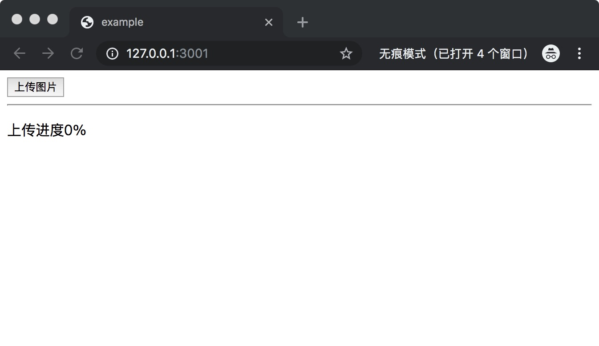
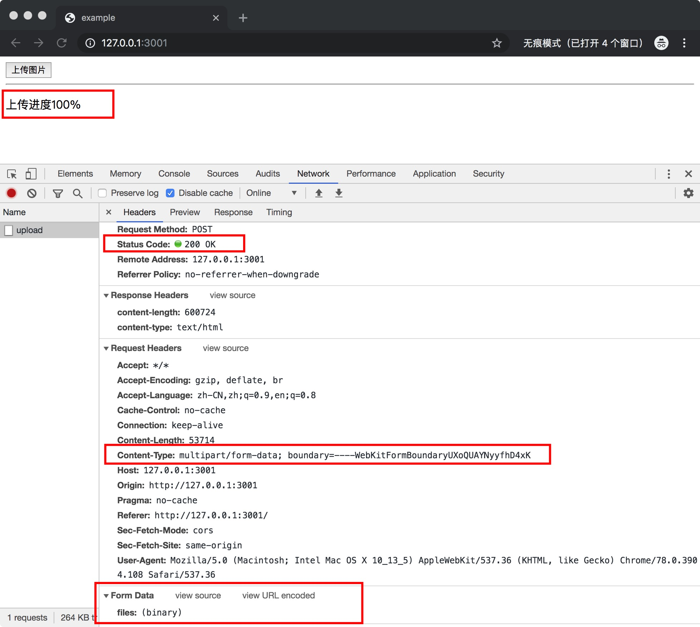

# 异步文件上传功能实现

## 前言

上一篇文章[《表单文件上传功能实现》](https://github.com/chenshenhai/deno_note/blob/master/note/chapter_06/web_upload.md) 主要是在浏览器端利用原生表单的提交上传文件，但是日常操作为了体验，都是把上传文件实现成异步操作能力，本篇文章基于上一篇文章的基础上，改进成异步上传能力。

实现源码

源码地址
[https://github.com/chenshenhai/deno_note/blob/master/demo/web_upload_async/example.ts](https://github.com/chenshenhai/deno_note/blob/master/demo/web_upload_async/example.ts)


## 实现原理


基于上一篇文章[《表单文件上传功能实现》](https://github.com/chenshenhai/deno_note/blob/master/note/chapter_06/web_upload.md) 

### 前端修改

把表单改成用`js`触发的动态表单，复用了我之前写过的 [《Koa2进阶学习笔记|异步上传图片实现》](https://github.com/ChenShenhai/koa2-note/blob/master/note/upload/pic-async.md) 里的前端代码

#### 前端模板

```html
<html>
  <head>
    <meta charset="utf-8">
    <title>example</title>
  </head>
  <body>
    <button class="btn" id="J_UploadPictureBtn">上传图片</button>
    <hr/>
    <p>上传进度<span id="J_UploadProgress">0</span>%</p>
  </body>
</html>
```

#### 前端JS操作

```js
(function(){

  let btn = document.getElementById('J_UploadPictureBtn')
  let progressElem = document.getElementById('J_UploadProgress')
  let previewElem = document.getElementById('J_PicturePreview')
  btn.addEventListener('click', function(){
    uploadAction({
      success: function( result ) {
        console.log( result )
        if ( result && result.success && result.data && result.data.pictureUrl ) {
          previewElem.innerHTML = ''
        }
      },
      progress: function( data ) {
        if ( data && data * 1 > 0 ) {
          progressElem.innerText = data
        }
      }
    })
  })


  /**
   * 类型判断
   * @type {Object}
   */
  let UtilType = {
    isPrototype: function( data ) {
      return Object.prototype.toString.call(data).toLowerCase();
    },

    isJSON: function( data ) {
      return this.isPrototype( data ) === '[object object]';
    },

    isFunction: function( data ) {
      return this.isPrototype( data ) === '[object function]';
    }
  }

  /**
   * form表单上传请求事件
   * @param  {object} options 请求参数
   */
  function requestEvent( options ) {
    try {
      let formData = options.formData
      let xhr = new XMLHttpRequest()
      xhr.onreadystatechange = function() {

        if ( xhr.readyState === 4 && xhr.status === 200 ) {
          options.success(JSON.parse(xhr.responseText))
        } 
      }

      xhr.upload.onprogress = function(evt) {
        let loaded = evt.loaded
        let tot = evt.total
        let per = Math.floor(100 * loaded / tot) 
        options.progress(per)
      }
      xhr.open('post', '/upload')
      xhr.send(formData)
    } catch ( err ) {
      options.fail(err)
    }
  }

  /**
   * 上传事件
   * @param  {object} options 上传参数      
   */
  function uploadEvent ( options ){
    let file
    let formData = new FormData()
    let input = document.createElement('input')
    input.setAttribute('type', 'file')
    input.setAttribute('name', 'files')

    input.click()
    input.onchange = function () {
      file = input.files[0]
      formData.append('files', file)

      requestEvent({
        formData,
        success: options.success,
        fail: options.fail,
        progress: options.progress
      })  
    }

  }

  /**
   * 上传操作
   * @param  {object} options 上传参数     
   */
  function uploadAction( options ) {
    if ( !UtilType.isJSON( options ) ) {
      console.log( 'upload options is null' )
      return
    }
    let _options = {}
    _options.success = UtilType.isFunction(options.success) ? options.success : function() {}
    _options.fail = UtilType.isFunction(options.fail) ? options.fail : function() {}
    _options.progress = UtilType.isFunction(options.progress) ? options.progress : function() {}
    
    uploadEvent(_options)
  }
})()
```

### 后端修改

基于上一篇文章[《表单文件上传功能实现》](https://github.com/chenshenhai/deno_note/blob/master/note/chapter_06/web_upload.md) 的主程序。

- 添加读取和渲染前端`HTML`代码操作
- 将上传的前端接口判断修改
- 修改文件流获取判断

```js
import { Application, Context } from "./../web/mod.ts";
import { parseContentType, parseMultipartForm } from "./../web_upload/bodyparser.ts";

const app = new Application();
const opts: Deno.ListenOptions = {
  hostname: "127.0.0.1",
  port: 3001
}

async function getPage(path: string): Promise<string> {
  const pageStram = await Deno.readFileSync(path);
  const page = new TextDecoder().decode(pageStram);
  return page;
}

app.use(async function(ctx: Context, next: Function) {
  const general = await ctx.req.getGeneral();
  const headers = await ctx.req.getHeaders();
  const bodyStream = await ctx.req.getBodyStream();

  const contentType = headers.get('Content-Type') || '';
  let body: string = ``;
  if (general.method === 'POST' && general.pathname === "/upload") {
    const formType = parseContentType(contentType);
    const formData = await parseMultipartForm(formType.boundary, bodyStream);
    if (formData[0].value instanceof Uint8Array && formData[0].value.length > 0) {
      Deno.writeFileSync(`./assets/${formData[0].filename}`, formData[0].value)
    }
    body = JSON.stringify(formData);;
  } else {
    body = await getPage("./index.html");
  }
  ctx.res.setStatus(200);
  ctx.res.setHeader('Content-Type', 'text/html');
  ctx.res.setBody(body);
  await next();
});

app.listen(opts, function() {
  console.log("the web is starting")
});
```


## 实现代码

源码地址

https://github.com/chenshenhai/deno_note/blob/master/demo/web_upload_async/

### Deno服务端代码

./demo/web_upload_async/example.ts

```js
import { Application, Context } from "./../web/mod.ts";
import { parseContentType, parseMultipartForm } from "./../web_upload/bodyparser.ts";

const app = new Application();
const opts: Deno.ListenOptions = {
  hostname: "127.0.0.1",
  port: 3001
}

async function getPage(path: string): Promise<string> {
  const pageStram = await Deno.readFileSync(path);
  const page = new TextDecoder().decode(pageStram);
  return page;
}

app.use(async function(ctx: Context, next: Function) {
  const general = await ctx.req.getGeneral();
  const headers = await ctx.req.getHeaders();
  const bodyStream = await ctx.req.getBodyStream();

  const contentType = headers.get('Content-Type') || '';
  let body: string = ``;
  if (general.method === 'POST' && general.pathname === "/upload") {
    const formType = parseContentType(contentType);
    const formData = await parseMultipartForm(formType.boundary, bodyStream);
    if (formData[0].value instanceof Uint8Array && formData[0].value.length > 0) {
      Deno.writeFileSync(`./assets/${formData[0].filename}`, formData[0].value)
    }
    body = JSON.stringify(formData);;
  } else {
    body = await getPage("./index.html");
  }
  ctx.res.setStatus(200);
  ctx.res.setHeader('Content-Type', 'text/html;charset=utf-8');
  ctx.res.setBody(body);
  await next();
});

app.listen(opts, function() {
  console.log("the web is starting")
});
```


### 前端代码

./demo/web_upload_async/index.html

```html
<html>
  <head>
    <meta charset="utf-8">
    <title>example</title>
  </head>
  <body>
    <button class="btn" id="J_UploadPictureBtn">上传图片</button>
    <hr/>
    <p>上传进度<span id="J_UploadProgress">0</span>%</p>

    <script>
    (function(){

      let btn = document.getElementById('J_UploadPictureBtn')
      let progressElem = document.getElementById('J_UploadProgress')
      let previewElem = document.getElementById('J_PicturePreview')
      btn.addEventListener('click', function(){
        uploadAction({
          success: function( result ) {
            console.log( result )
            if ( result && result.success && result.data && result.data.pictureUrl ) {
              previewElem.innerHTML = ''
            }
          },
          progress: function( data ) {
            if ( data && data * 1 > 0 ) {
              progressElem.innerText = data
            }
          }
        })
      })


      /**
       * 类型判断
       * @type {Object}
       */
      let UtilType = {
        isPrototype: function( data ) {
          return Object.prototype.toString.call(data).toLowerCase();
        },

        isJSON: function( data ) {
          return this.isPrototype( data ) === '[object object]';
        },

        isFunction: function( data ) {
          return this.isPrototype( data ) === '[object function]';
        }
      }

      /**
       * form表单上传请求事件
       * @param  {object} options 请求参数
       */
      function requestEvent( options ) {
        try {
          let formData = options.formData
          let xhr = new XMLHttpRequest()
          xhr.onreadystatechange = function() {

            if ( xhr.readyState === 4 && xhr.status === 200 ) {
              options.success(JSON.parse(xhr.responseText))
            } 
          }

          xhr.upload.onprogress = function(evt) {
            let loaded = evt.loaded
            let tot = evt.total
            let per = Math.floor(100 * loaded / tot) 
            options.progress(per)
          }
          xhr.open('post', '/upload')
          xhr.send(formData)
        } catch ( err ) {
          options.fail(err)
        }
      }

      /**
       * 上传事件
       * @param  {object} options 上传参数      
       */
      function uploadEvent ( options ){
        let file
        let formData = new FormData()
        let input = document.createElement('input')
        input.setAttribute('type', 'file')
        input.setAttribute('name', 'files')

        input.click()
        input.onchange = function () {
          file = input.files[0]
          formData.append('files', file)

          requestEvent({
            formData,
            success: options.success,
            fail: options.fail,
            progress: options.progress
          })  
        }

      }

      /**
       * 上传操作
       * @param  {object} options 上传参数     
       */
      function uploadAction( options ) {
        if ( !UtilType.isJSON( options ) ) {
          console.log( 'upload options is null' )
          return
        }
        let _options = {}
        _options.success = UtilType.isFunction(options.success) ? options.success : function() {}
        _options.fail = UtilType.isFunction(options.fail) ? options.fail : function() {}
        _options.progress = UtilType.isFunction(options.progress) ? options.progress : function() {}
        
        uploadEvent(_options)
      }
    })()
    </script>
  </body>
</html>
```

## 实现效果


### 执行脚本

正在`./demo/web_upload_async/`目录下执行


```sh
deno --allow-net --allow-write --allow-read example.ts
```

浏览器打开 [http://127.0.0.1:3001/](http://127.0.0.1:3001/)

### 预览效果


#### 异步上传前




#### 异步上传后




