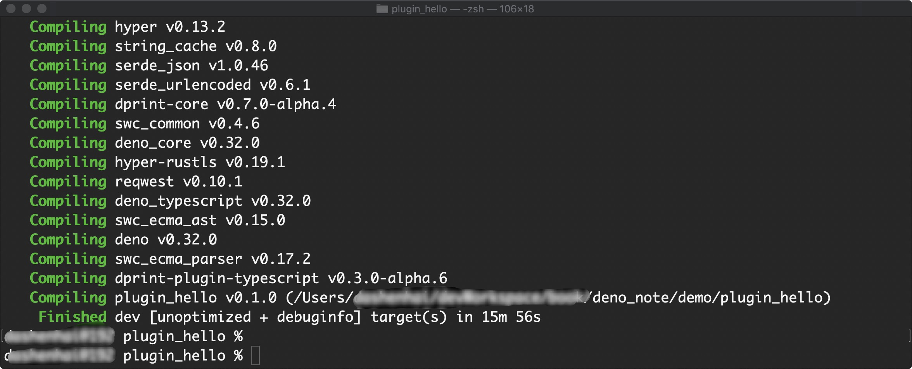

# 插件开发入门

## 前言

// TODO

## 环境

- MacOS `v10.15+`
  - Xcode `v11.3.1+`
- Rust `v1.41.0 +`

## 开发插件

### 例子源码

- 源码地址 [https://github.com/chenshenhai/deno_note/blob/master/demo/plugin_hello/](https://github.com/chenshenhai/deno_note/blob/master/demo/plugin_hello/)

### 初始化Rust项目

```sh
# 创建目录
mkdir plugin_hello

# 进入目录
cd plugin_hello

# 执行 Rust项目初始化
cargo init --lib
```

### 初始化插件设置

#### 配置Rust依赖

在项目目录的Rust `./Cargo.toml` 添加开发 Deno 插件的 配置Rust依赖

```toml
[dependencies]
futures = "0.3"
deno_core = "0.42"
```

设置编译类型

```toml
[lib]
crate-type = ["cdylib"]
```

最后完整`Cargo.toml`结果为 

```toml
[package]
name = "plugin_hello"
version = "0.1.0"
authors = [""]
edition = "2018"

# See more keys and their definitions at https://doc.rust-lang.org/cargo/reference/manifest.html
[lib]
crate-type = ["cdylib"]

[dependencies]
futures = "0.3"
deno_core = "0.42"
```

### 编写Rust插件内容

#### 插件源码

- 在项目的 `./src/` 目录下，新建 `lib.rs` 文件。
- 在文件里定义`Deno`插件的异步和同步的两个方法

```rs
extern crate deno_core;
extern crate futures;

use deno_core::Op;
use deno_core::CoreIsolate;
use deno_core::{Buf, ZeroCopyBuf};
use futures::future::FutureExt;

// 初始化
#[no_mangle]
pub fn deno_plugin_init(isolate: &mut CoreIsolate) {
  isolate.register_op("testSync", op_test_sync);
  isolate.register_op("testAsync", op_test_async);
}

// 定义插件的同步方法
pub fn op_test_sync(
  _isolate: &mut CoreIsolate,
  data: &[u8], 
  zero_copy: Option<ZeroCopyBuf>
) -> Op {
  // 解析接收到的两个 参数信息，转换成字符串
  let controll = std::str::from_utf8(&data[..]).unwrap().to_string();
  let &mut opts;
  match zero_copy {
    // 如果为空
    None => opts = "".to_string(), 
    // 如果存在
    Some(buf) => opts = std::str::from_utf8(&buf[..]).unwrap().to_string(), 
  }

  // 打印接收到的 两个参数
  println!("[Rust] op_test_sync:receive (\"{}\", \"{}\")", controll, opts);

  // 返回结果
  let result = b"ok!";
  let result_box: Buf = Box::new(*result);

  Op::Sync(result_box)
}


// 定义插件的异步方法
pub fn op_test_async(
  _isolate: &mut CoreIsolate,
  data: &[u8],
  zero_copy: Option<ZeroCopyBuf>,
) -> Op {
  // 解析接收到的第一个 参数信息，转换成字符串
  let data_str = std::str::from_utf8(&data[..]).unwrap().to_string();
  let fut = async move {
    // 异步解析第二个参数
    if let Some(buf) = zero_copy {
      let opts = std::str::from_utf8(&buf[..]).unwrap();
      println!("[Rust] op_test_async:receive (\"{}\", \"{}\")", data_str, opts);
    }
    let (tx, rx) = futures::channel::oneshot::channel::<Result<(), ()>>();
    std::thread::spawn(move || {
      std::thread::sleep(std::time::Duration::from_secs(1));
      // 结束异步操作
      tx.send(Ok(())).unwrap();
    });
    assert!(rx.await.is_ok());
    let result = b"test";
    let result_box: Buf = Box::new(*result);
    result_box
  };

  Op::Async(fut.boxed())
}
```

#### 编译插件

在项目目录下执行 Cargo对Rust的编译

```sh
cargo build
```

初次编译会等待很久，因为要下载 `deno_core` 这个 Rust 依赖。


最后编译成功会显示这样子 



插件编译成后，在目录 `./target/debug/` 下会生成一系列在不同系统下的可执行文件。

当前是在`MacOS`系统下生成的，所以这里要使用 `./target/debug/libplugin_hello.dylib` 这个生成结果

- `libplugin_hello.dylib` 这个结果命名是`lib` + `{{项目名称}}` + `{{生成库的后缀}}`

### 编写Deno调用的测试用例

在项目目录 `./tests/` 下建一个 `test.js` 文件

> 注意: 由于目前 Deno v0.42.0 对插件的支持属于 实验阶段，所以对 *.ts 支持不稳定，选用 *.js 的文件格式进行操作


```js
const filenameBase = "libplugin_hello";

let filenameSuffix = ".so";
let filenamePrefix = "lib";

if (Deno.build.os === "windows") {
  filenameSuffix = ".dll";
  filenamePrefix = "";
}
if (Deno.build.os === "darwin") {
  filenamePrefix = "";
  filenameSuffix = ".dylib";
}

const filename = `../target/debug/${filenamePrefix}${filenameBase}${filenameSuffix}`;

// 开启插件，并获取进程的 ID
const rid = Deno.openPlugin(filename);
const { testSync, testAsync } = Deno.core.ops();
if (!(testSync > 0)) {
  throw "bad op id for testSync";
}
if (!(testAsync > 0)) {
  throw "bad op id for testAsync";
}

const textDecoder = new TextDecoder();
const textEncoder = new TextEncoder();

// 执行 调用插件的 同步方法
const response = Deno.core.dispatch(
  testSync,
  textEncoder.encode('hello'),
  textEncoder.encode('sync'),
);
console.log(`[Deno] testSync Response: ${textDecoder.decode(response)}`);

console.log('-------------------------------')

// 执行 调用插件的 异步方法
// 注册异步的回调操作
Deno.core.setAsyncHandler(testAsync, (res) => {
  console.log(`[Deno] testAsync Response: ${textDecoder.decode(res)}`);
});
// 触发异步方法事件
Deno.core.dispatch(
  testAsync,
  textEncoder.encode('test'),
  textEncoder.encode('test'),
);

// 关闭 插件调用
Deno.close(rid);
```


#### 测试结果

在 `./test/` 下执行

```sh
 deno --unstable --allow-plugin test.js
```

会输出一下结果，就说明 Rust 插件调通了


